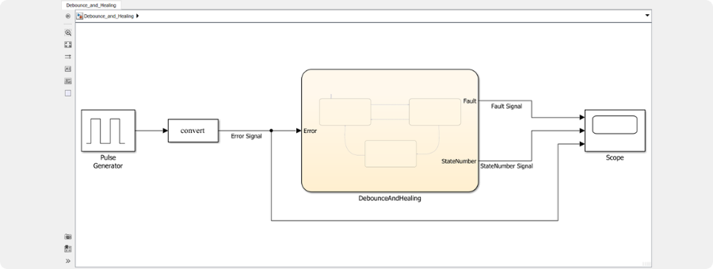
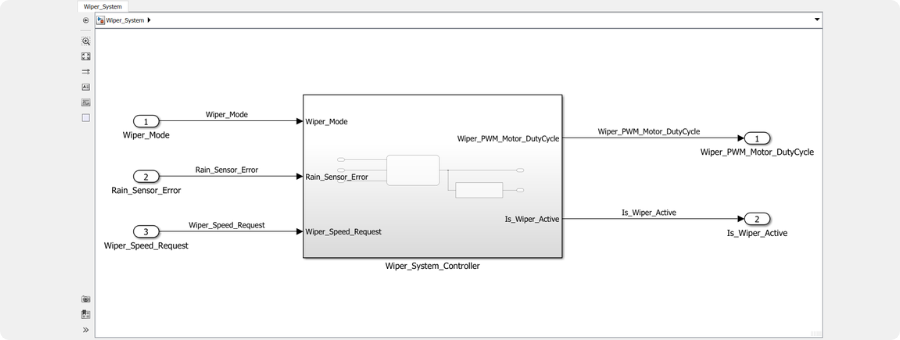
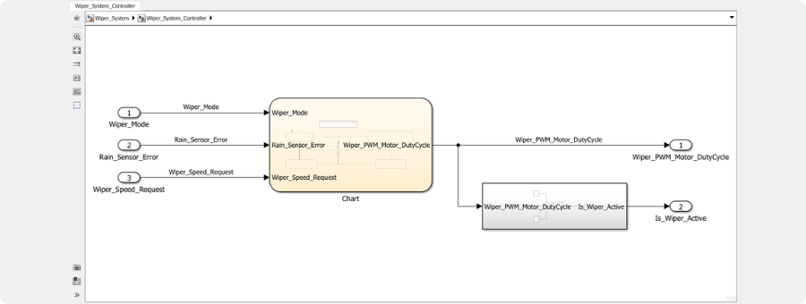
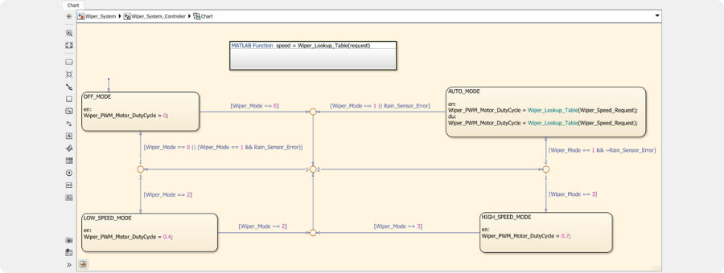
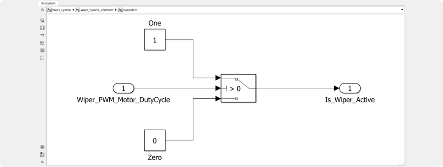
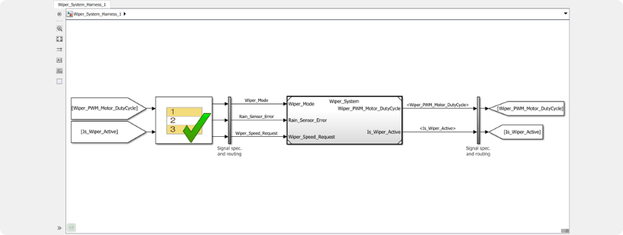
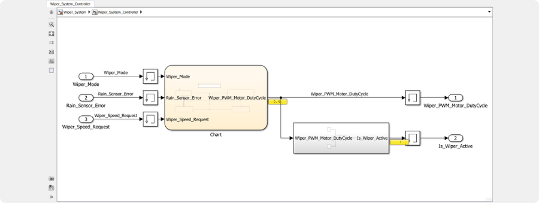

# Model Based Design - MBD

## Debounce and Healing Example

 _• Debounce and Healing Model_

 _• Debounce and Healing Chart_

 _• Debounce and Healing Scope_

## Automotive Wiper System

 _• Automotive Wiper System_

 _• Wiper System Controller_

 _• Wiper System Chart_

 _• Wiper System State Comparator_

 _• Wiper System Harness_

 _• Wiper System Harness Test_

